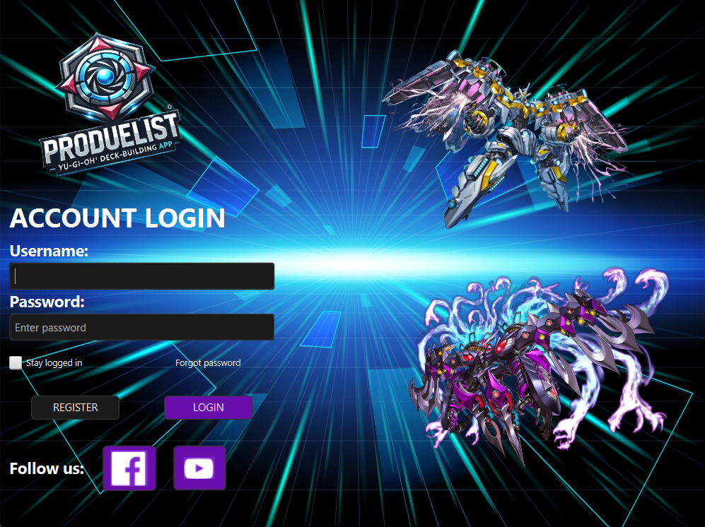
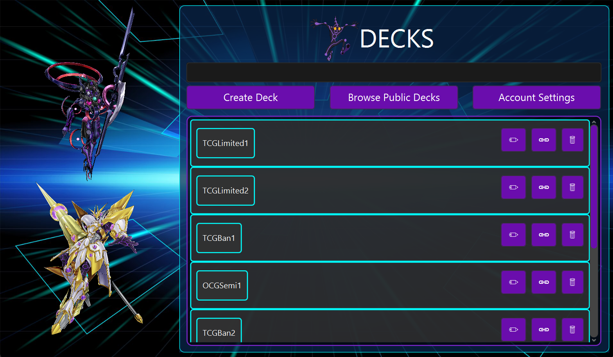
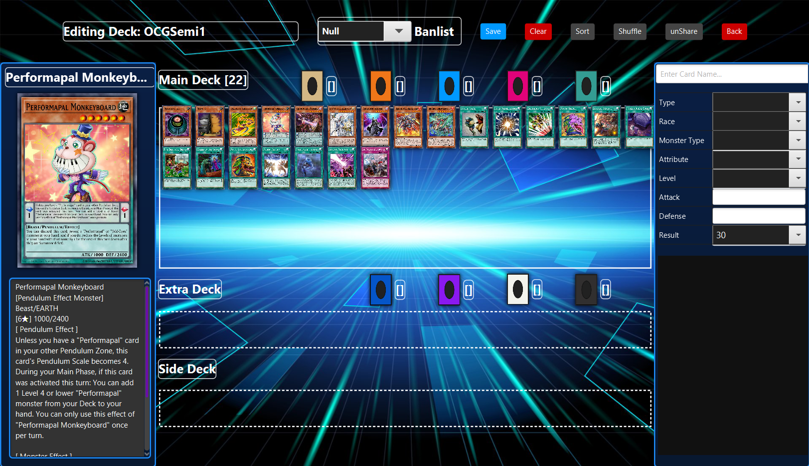
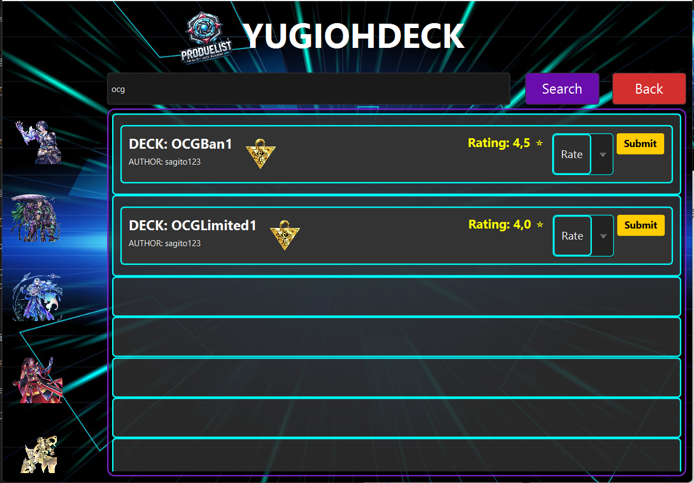

# PRODUELIST

## Giới thiệu

- Bạn là một người đam mê Yu-Gi-Oh! và muốn xây dựng bộ bài tối ưu của riêng mình? ProDuelist chính là công cụ hoàn hảo dành cho bạn! Ứng dụng này giúp bạn dễ dàng tạo, quản lý và tinh chỉnh deck theo ý muốn, giúp bạn chinh phục mọi trận đấu với chiến thuật hoàn hảo. Với giao diện trực quan và dữ liệu bài được cập nhật đầy đủ, ProDuelist là trợ thủ đắc lực cho mọi Duelist.

- Tính năng chính

  + Quản lý tài khoản người dùng (Đăng ký, Đăng nhập).

  + Tạo, chỉnh sửa, xóa và quản lý bộ bài.

  + Lưu trữ dữ liệu hơn 13.000 lá bài Yu-Gi-Oh! từ API chính thức.

  + Hiển thị danh sách các lá bài với thông tin chi tiết.

  + Giao diện trực quan, dễ sử dụng.

  + Hỗ trợ chia sẻ Deck bài giữa người dùng với nhau giúp việc build bài trở nên dễ hơn bao giờ hết.

- Công nghệ sử dụng

  + Ngôn ngữ lập trình: Java

  + Giao diện: JavaFX, SceneBuilder (FXML)

  + Database: SQLite, supabasesupabase

  + Mô hình kiến trúc: MVC (Model - View - Controller)

## Cấu trúc thư mục

ProDuelist/
│── Data/
│   ├── music.json
│   ├── user.jsonjson
│── out/artifacts/ProDuelist_jar
│       ├── ProDuelist.exe
│       ├── ProDuelist.jar
│       ├── ProDuelist.xml
│── src/main
│   ├── Controller/
│   ├── Model/
│   ├── Utils/
│   ├── View/
│   │   ├── Main.java
│   ├── org/example/produelist
│   │   ├── CreateSQLiteDatabase.java
│   ├── resources
│   │   ├── Database
│   │   ├── FXML
│   │   ├── Images
UML/

## Hướng dẫn cài đặt

- Clone repository:

> git clone https://github.com/Sagitoaz/ProDuelist.git

- Mở dự án bằng IDE (IntelliJ, Eclipse, NetBeans).

- Chạy ứng dụng:

  + Cách 1: Mở Main.java và chạy chương trình.

  + Cách 2: Mở ProDuelist.exe và chạy chương trìnhtrình

## Hướng dẫn sử dụng

+ Đăng ký tài khoản: Nhập email, tên đăng nhập và mật khẩu để tạo tài khoản.

+ Đăng nhập: Sử dụng thông tin tài khoản đã đăng ký để truy cập ứng dụng.

+ Tạo bộ bài mới: Nhập tên bộ bài và thêm các lá bài vào deck.

+ Quản lí Deck bài: Xóa Deck, tạo Deck và chia sẻ Deck đến người dùng khác

+ Tìm kiếm Deck: Nhập từ khóa cần tìm, chọn Deck để xem và tải về, đánh giá mức độ hiệu quả của DeckDeck

## Video Hướng dẫn

> https://www.youtube.com/watch?v=09nxmFrDCCg

Đóng góp

> Nếu bạn muốn đóng góp cho dự án, vui lòng tạo pull request hoặc gửi mail cho mình để thảo luận.

---

Liên hệ

Author: Sagito

Email: trung241az@gmail.com

ProDuelist - Build Your Ultimate Deck!